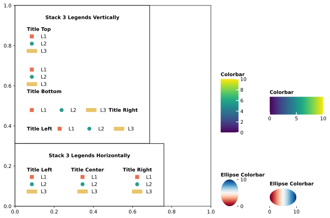
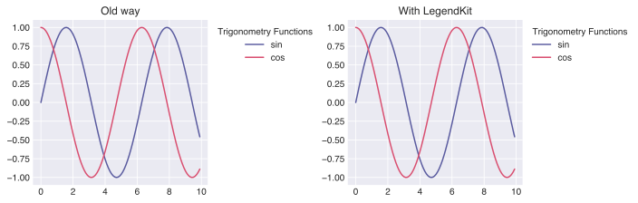
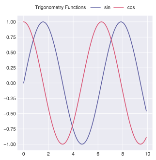
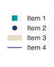
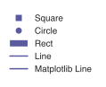
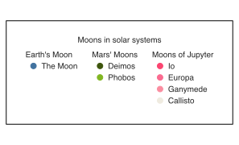

<p align="center">

</p>

When you want to create or adjust the legend in matplotlib, things can get dirty. 
LegendKit may solve your headache.



## Features

- Easy title placement and alignment
- Layout for multiple legends
- Easy colorbar

## Installation

```shell
pip install legendkit
```

## Usage

### Use it as the same old day

First create a plot

Usually, this is how you create the legend, the long title looks bad when it place at the center.
But you can do nothing about it.

```python
import numpy as np
import matplotlib.pyplot as plt

x = np.arange(0, 10, 0.1)
plt.plot(x, np.sin(x), color="r", label="sin")
plt.plot(x, np.sin(x), color="r", label="cos")
plt.legend(title="Trigonometry Functions")
```

With legendkit, things are easy, replace the default legend creation
```python
from legendkit import legend
# plt.legend(title="Trigonometry Functions")
legend(title="Trigonometry Functions", title_align="left")
```



You can even create legend like this
```python
legend(title="Trigonometry Functions", title_pos="left", ncol=2)
```




### Create a custom legend

If you want to create a custom legend, it's pretty easy to do it. Simple use an array to define it.

```python
from legendkit import legend

legend(legend_items=[
    # (handle, label, config)
    ('square', 'Item 1', {'color': '#01949A'}),
    ('circle', 'Item 2', {'facecolor': '#004369', 'edgecolor': '#DB1F48', 'linewidth': 0.5}),
    ('rect', 'Item 3', {'color': '#E5DDC8'}),
    # Or you can have no config at all
    ('line', 'Item 4'),
])

```



Or you can use matplotlib legend handlers for richer definition.

LegendKit provides you with some predefined handlers to use out of the box.

```python
from legendkit import legend
from legendkit.handles import SquareItem, CircleItem, RectItem, LineItem
from matplotlib.lines import Line2D

legend(
    handles=[SquareItem(), CircleItem(), RectItem(), LineItem(), Line2D([], [])], 
    labels=['Square', 'Circle', 'Rect', 'Line', 'Matplotlib Line'
])

```



If you want to use highly customized element as entry, 
please refer to [here](https://matplotlib.org/stable/tutorials/intermediate/legend_guide.html#implementing-a-custom-legend-handler)


### Composing multiple legends

Sometimes you may want to group few legends together

- `vstack` is used to stack legends vertically
- `hstack` is used to stack legends horizontally

```python
import matplotlib.pyplot as plt
from legendkit import legend
from legendkit.layout import vstack, hstack

_, ax = plt.subplots()

legend1 = legend(legend_items=[
    ('circle', 'The Moon', {'color': '#41729F'}),
], title="Earth's Moon")

legend2 = legend(legend_items=[
    ('circle', 'Deimos', {'color': '#3D550C'}),
    ('circle', 'Phobos', {'color': '#81B622'}),
], title="Mars' Moons")

legend3 = legend(legend_items=[
    ('circle', 'Io', {'color': '#FB4570'}),
    ('circle', 'Europa', {'color': '#FB6B90'}),
    ('circle', 'Ganymede', {'color': '#FB8DA0'}),
    ('circle', 'Callisto', {'color': '#EFEBE0'}),
], title="Moons of Jupyter")

legends = hstack([legend1, legend2, legend3], title="Moons in solar systems", spacing=10, frameon=True)
ax.add_artist(legends)  # Make sure you add it to the axes, or it won't be rendered

```

