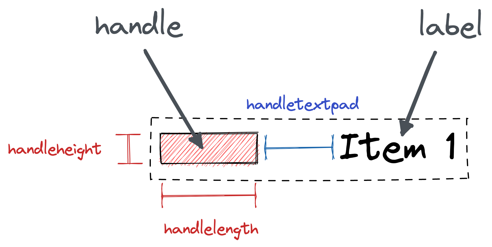
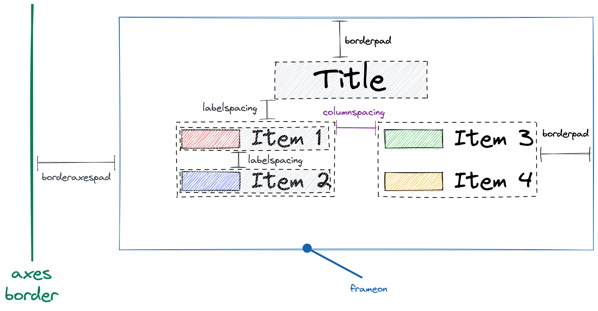

Understand layout in matplotlib legend
======================================

If you are familiar with css flexbox model, this is similar to how legend is layout internally in matplotlib.

A matplotlib legend have at least two parts, the handle and the label.

- handle: The graphic to represent the item in the plot.
- label: The text for the item.

Parameters to control the layout
--------------------------------

The units used in the layout system is the same as font size.

- **handleheight**: The height of the handle.
- **handlelength**: The length of the handle.
- **handletextpad**: The distance between the handle and the label.

- **labelspacing**: This control the distance between different legend items,
  it also controls the distance between title and items.
- **columnspacing**: The distance between multiple columns of items.
- **frameon**: Toggle the on/off of the outer frame.
- **borderpad**: The distance between the actual legend and the outer frame, apply for both x and y direction.
- **borderaxespad**: The distance between the axes and the legend.